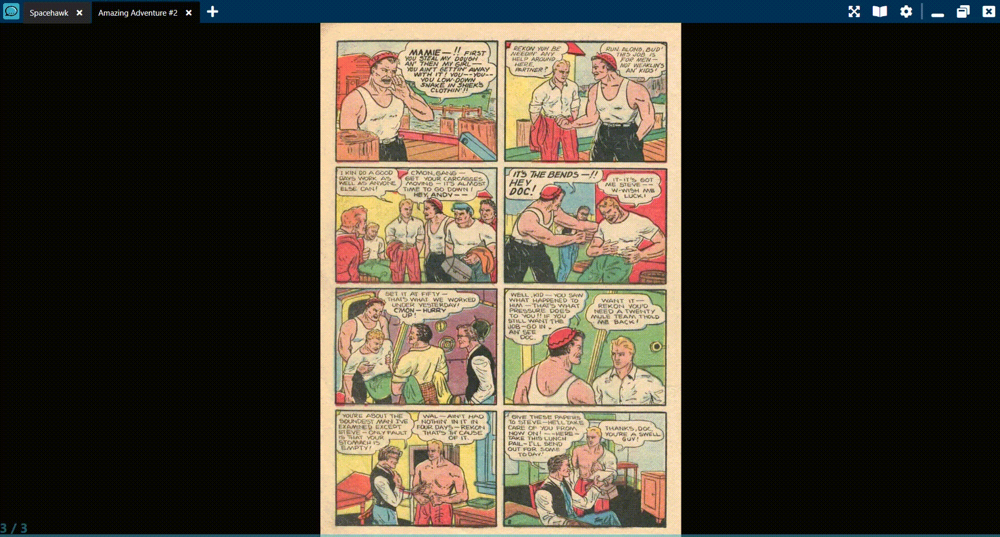

# Kola
Kola is application made for reading comic books.

Comic books usually comes in following formats:
* PDF - Well, just regular pdf
* CBR - It's just a RAR archive with set of images
* CBZ - Same as CBR, but it's ZIP archive

## Summary

### One window application
if you open two files in Windows Explorer, both of them will open in same application instance, but in separated tabs.

### Magnifier

### Keyboard-controlled zoom

### multilingual Wikipedia/wiktionary widget
